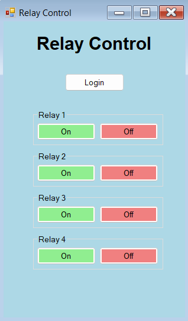

# TIBBO Relay Control GUI

## Project Overview
This GUI application was developed during an internship at BARC (Bhabha Atomic Research Centre), India. It provides a user-friendly interface to control relays on a TIBBO device, utilizing its built-in webserver functionality.

## Features
- Remote relay control through a graphical user interface
- Communication with TIBBO device using HTTP protocols
- Implementation of GET and POST commands for relay control
- Automatic session management for secure communication
- Utilization of WebBrowser functionality to interact with the TIBBO webserver

## Technologies Used
- C# for application development
- .NET Framework for GUI creation
- HTTP protocols for server communication

## How It Works
1. The application establishes a connection with the TIBBO device's webserver.
2. It obtains a session ID for secure communication.
3. Users can interact with the GUI to control relays.
4. The application sends appropriate HTTP commands (GET/POST) to the TIBBO webserver.
5. WebBrowser functionality is used to simulate button presses on the webserver interface when necessary.

## Usage
It has a very simple and easy to use interface, after you push the Login button (You have to set the correct IP inside the code first), Relay buttons will pop up and you can directly use the relay on and off buttons to control them.

## Screenshots

## Acknowledgements
This project was completed during an internship at BARC, India. Special thanks to Mr. Abhishek Jaju for their guidance and support.

## Contact
Akshat Pandey | akshatp1903@gmail.com

---
Note: I have the permission to upload this on here, as this was a small part of the project I did.
